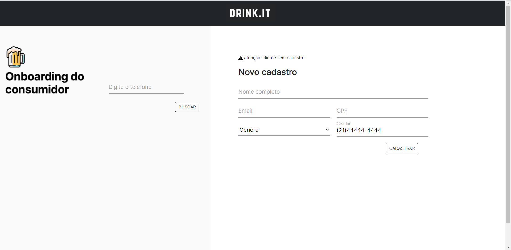

<h1>FIAP Fase 1: Connection</h1>

<h3>Início</h3>

O desafio do connection da Fiap consiste em desenvolver uma aplicação que registre pedidos de clientes dentro de Bar.  Caso o cliente seja novo, será aberto um formulário on board do qual terá que informar seus dados. 

Caso ele já tenha frequentado o estabelecimento, a aplicação precisará responder as seguintes perguntas:

* <b>Qual a data da última visita ao estabelecimento?</b>
* <b>Qual é a frequência de visitas?</b>
* <b>Qual é o ticket médio (valor médio gasto no estabelecimento)?</b>
* <b>Qual é a bebida e o estilo (cervejas IPA, Pilsen etc.) favoritos com base no consumo?</b>

A ideia é, com base nestas informações, o atendimento aconteça de forma personalizada a cada cliente que venha a frequentar o bar.

Este projeto foi dividido nos seguintes tópicos:

1. Modelo
2. Funcionalidades
3. Considerações finais

<h3>Modelo</h3>

O modelo de negócios foi feito da seguinte forma:

<b>Cliente:</b> Consumidor do estabelecimento, seus dados serão armazenados na Tabela `BAR_CLIENTE`. Nome e celular são informações obrigatórias.

<b>Comanda:</b> Registro de consumo de um cliente em um determinado período. Informações postas na tabela `BAR_COMANDA`.

<b>Bebidas:</b> Produtos oferecidos pelo bar. Estes vão estar presentes na tabela `BAR_BEBIDAS`.

#################################################################

<b>Relacionamento entre CLIENTE e COMANDA:</b>

Um cliente pode ter mais de uma comanda conforme ele frequente o bar, contudo uma comanda não pode pertencer a mais de um cliente.

<b>Relacionamento entre COMANDA e BEBIDA:</b>

Uma comanda pode registrar multiplas bebidas da mesma forma que uma bebida pode estar em multiplas comandas. Em ambos dos casos pode ocorrer repetição ou não de um mesmo pedido, por isso foi criada a tabela auxiliar `BAR_PEDIDOS` para registrar esses casos.

 #################################################################

*Obs:*

O Cliente obrigatoriamente terá uma comanda no momento que entra no estabelecimento, contudo ele pode optar em consumir ou não uma bebida. 

<h3>Funcionalidades</h3>

* <b>Busca utilizando o telefone como chave</b>

  Logo na página principal haverá um campo do qual o atendente deverá colocar o telefone. O programa irá buscar o cliente na base de dados que possua este telefone.

  

  

  Caso o atendente encontre-o, o site vai mostrar o seu `dashboard` de analise e a tela de `comanda` para registrar os seus pedidos. Caso contrario o site vai mostrar a tela de `Cadastro`. Explico mais detalhadamente <a href="assets/buscaCliente.mp4" >neste vídeo</a>. 

* <b>Cadastra cliente</b>

  Na tela de `cadastro` o atendente deve preencher os campos para registrar o cliente. Os campos nome e telefone são obrigatórios. Ao preenche-los o site passa para a tela de `comanda` para registrar os pedidos deste novo cliente.

  

  

  <a href="assets/cadastro.mp4" >Neste vídeo</a> explico melhor.

  

* <b>Registra pedidos</b>

  A tela `comanda` controla o consumo do cliente. Primeiramente o atendente busca o que ele deseja por meio do campo de seleção que já puxa todas as bebidas registradas no banco. Ao selecionar a bebida os campos abaixo mostram mais informações sobre o produto. A medida que o atendente adiciona os pedidos, eles vão ficando armazenados dentro de um elemento rolavel que vai mostrando cada item e o seu somatório. Caso haja algum equivoco no pedido sempre há a opção de remove-lo da listagem.

  

  

  <a href="assets/comanda.mp4" >Neste vídeo</a> ilustro o caso.

* <b>Analise Dashboard</b>

  A medida que o cliente vai frequentando o estabelecimento o site vai guardando suas preferencias a fim de torna o atendimento cada vez mais personalizado. O `dashboard` retorna para o atendente dados importantes sobre o cliente, conforme solicitado pela atividade, a tela mostra os seguintes aspectos:

  * <b>A data da última visita ao estabelecimento.</b>

  * <b>A frequência de visitas.</b>

  * <b>O ticket médio (valor médio gasto no estabelecimento).</b>

  * <b>A bebida e o estilo (cervejas IPA, Pilsen etc.) favoritos </b>.

    

  

<h3>Considerações finais</h3>

O projeto está rodando em server local na porta 8084

Futuramente devo deixar esse projeto para ser visto em cloud por meio do heroku, ainda estudando a ideia.

<h4><a href="https://github.com/Amorim-cyber/fiap2_fase1_connection3">CLICK AQUI PARA VER O PROJETO NO GITHUB</a></h4>

<h4>Forte Abraço!!</h4>

 
